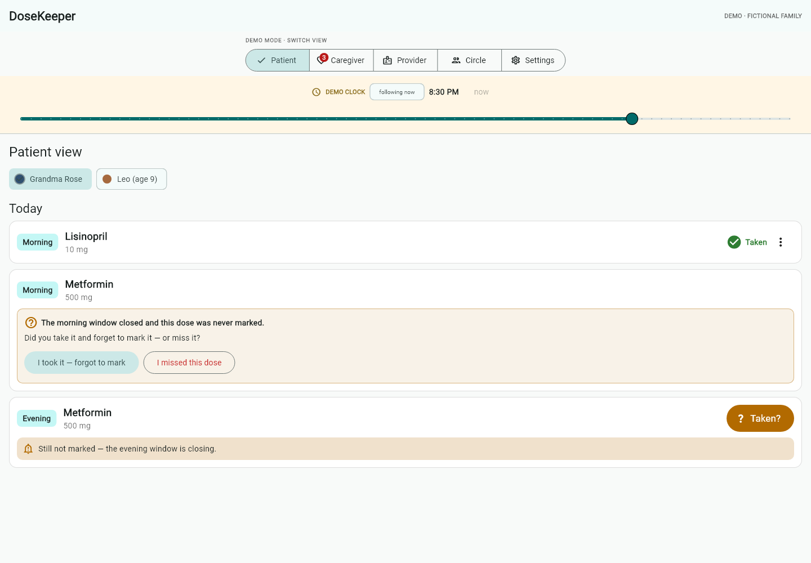
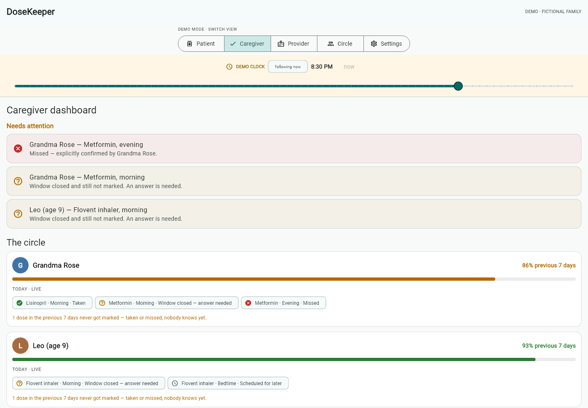
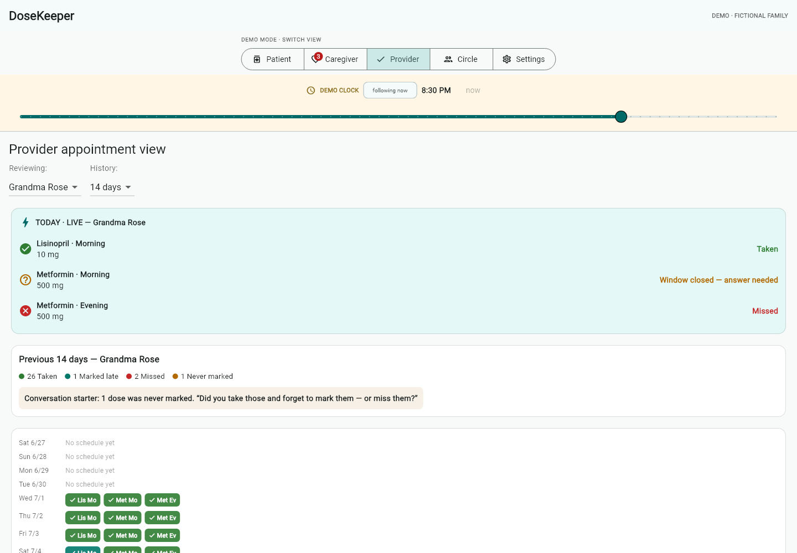
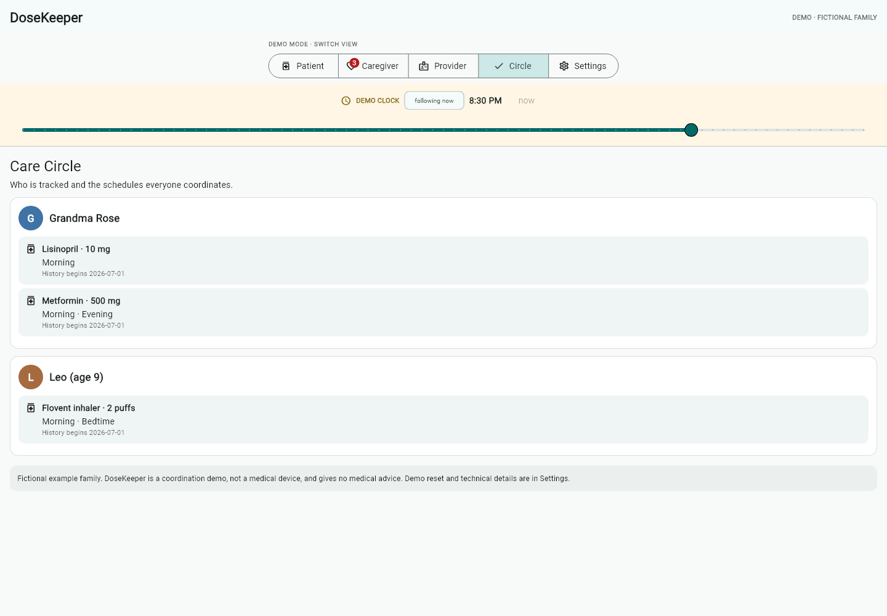
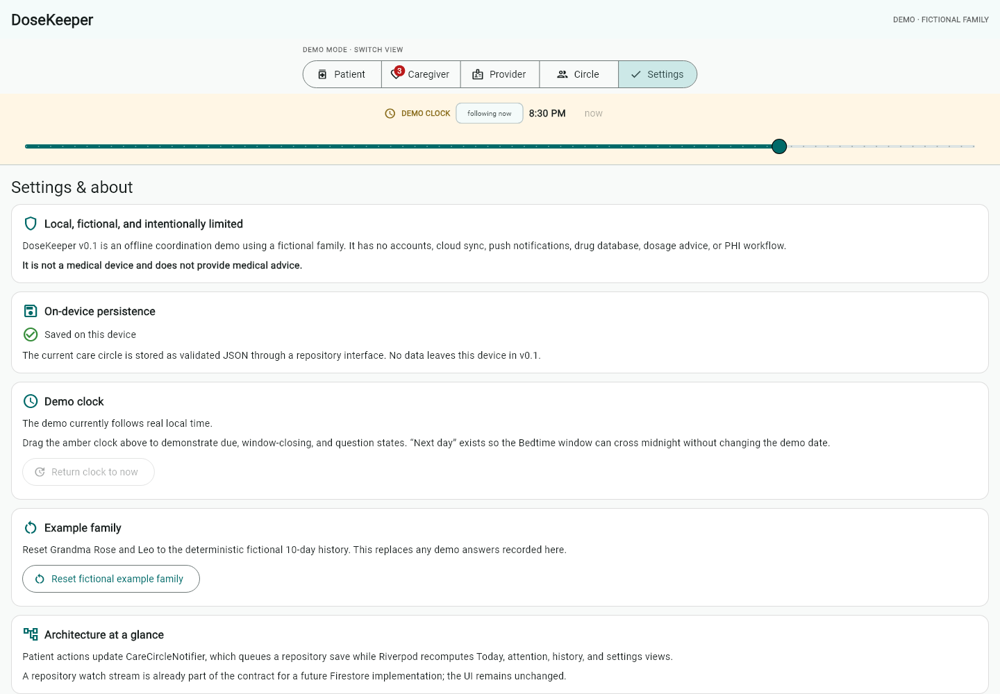
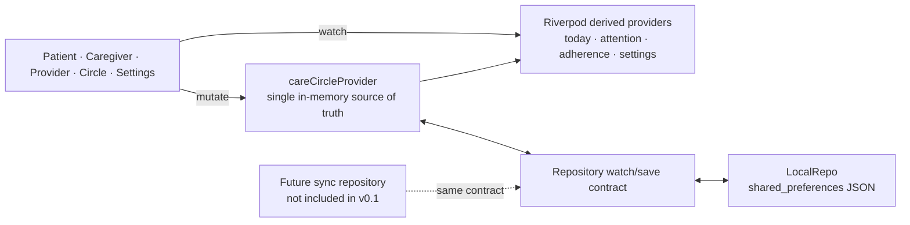

# DoseKeeper

[](https://github.com/Xyloth/dosekeeper/actions/workflows/ci.yml)
[](https://github.com/Xyloth/dosekeeper/actions/workflows/pages.yml)
[](LICENSE)

DoseKeeper is a Flutter medication care-coordination demo built around one deliberately strict idea: **taken, missed, and not marked are three different states**. A person marks a dose in the Patient view, and the Caregiver and Provider views react to the same Riverpod state without passing data between screens.

> The care circle and medication names are fictional. DoseKeeper is a personal/family coordination demo, not a medical device. It does not provide dosage guidance, interaction checking, reminders guaranteed to fire, or medical advice.

**Deployment target:** [xyloth.github.io/dosekeeper](https://xyloth.github.io/dosekeeper/) · **Platform targets:** web (verified) and Windows (CI bonus lane) · **Cost:** free/open-source tooling only

## What the demo proves

- **Five perspectives, one state graph:** Patient, Caregiver, Provider, Circle, and Settings all watch Riverpod providers derived from one persisted care-circle snapshot.
- **A visible cross-role invariant:** tapping the amber “Taken?” action changes the Patient dose, Caregiver attention count, Provider Today panel, and relevant badges immediately.
- **Three-state integrity:** an unresolved dose stays amber and remains `notMarked`; only a human can resolve it as green `taken` or red `missed`.
- **Human escalation:** a labeled demo clock moves a dose from heads-up to window-closing to “Did you take it and forget to mark it, or did you miss it?”
- **Correctable history:** a mistaken answer can be corrected or undone, with the same update propagating everywhere.
- **Deterministic time behavior:** injected date/time providers make threshold and midnight-rollover behavior testable instead of depending on the wall clock.
- **Offline persistence behind a boundary:** `LocalRepo` stores JSON with `shared_preferences` and exposes a watch contract. A future synchronized repository can feed the same state layer; Firestore is not implemented in v0.1.

## Screens

| View | Purpose |
| --- | --- |
| Patient | Large, simple dose cards; mark taken; answer unresolved-dose questions; correct an entry. |
| Caregiver | Prioritized attention list and per-person today/week status, including confirmed misses. |
| Provider | A live Today panel plus date-range history that preserves taken/missed/not-marked distinctions. |
| Circle | Read-only fictional people, medications, and human-readable schedules. |
| Settings | Demo-clock explanation, example-data reset, persistence state, and safety/disclaimer information. |

## Verified release views

These are deterministic 1440×1000 captures of the full Flutter widget tree with the bundled fictional family—not mockups.

| Patient | Caregiver | Provider |
| --- | --- | --- |
|  |  |  |
| Circle | Settings | |
|  |  | |

[`docs/screenshots/`](docs/screenshots/) contains the reproducible capture command and state contract.

## Architecture



The UI never passes a mutated model from one role screen to another. It sends an intent to the notifier; derived providers recompute, and every interested view rebuilds from the new snapshot. Persistence writes are kept behind the repository rather than embedded in widgets.

The event key is a schedule slot plus local calendar date. An event records `taken` (including when it was recorded), `missed` (explicitly confirmed), or no event, which derives to `notMarked`. Known-history boundaries keep dates outside the seeded data from being reported as non-adherence.

## Run locally

Prerequisites: [Flutter 3.44.6 stable](https://docs.flutter.dev/get-started/install) (Dart 3.12.2) and a web-capable device.

```powershell
git clone https://github.com/Xyloth/dosekeeper.git
cd dosekeeper/app
flutter pub get
flutter run -d chrome
```

The app opens with a clearly labeled fictional family. Use **Demo clock** to cross a dose-window boundary without changing the computer clock. Use **Settings → Reset fictional example family** to restore the known starting state.

For Windows desktop:

```powershell
flutter config --enable-windows-desktop
flutter run -d windows
```

Windows plugin builds require symlink support. Enable Windows Developer Mode if Flutter reports that plugins cannot create symlinks.

## Verify

Run the same gates used in CI:

```powershell
cd app
dart format --output=none --set-exit-if-changed lib test
flutter analyze
flutter test
flutter build web --release
```

The tests cover domain-state integrity, persistence/reload behavior, time boundaries, selection stability, and the headline widget flow: a Patient interaction updates Caregiver and Provider UI from shared state.

## 60-second demo

1. **0–8s:** Point out the fictional-data banner and the five role views.
2. **8–20s:** In Patient, select Grandma Rose and mark an unmarked dose taken.
3. **20–32s:** Open Caregiver; show that the attention count and Rose’s chips changed without a refresh.
4. **32–42s:** Open Provider; show the same event in the live Today panel and the historical three-state legend.
5. **42–53s:** Move the labeled demo clock past a window. Answer the human-only question once as “missed” and once as “taken, forgot to mark.”
6. **53–60s:** Correct/undo one answer and show the other views follow; finish on Settings and the local-only disclaimer.

## Deployment

[`pages.yml`](.github/workflows/pages.yml) builds with the repository base path and deploys the release artifact to GitHub Pages on pushes to `main`. In repository settings, choose **GitHub Actions** as the Pages source. The workflow requests only `contents: read`, `pages: write`, and the OIDC permission required by Pages.

[`windows.yml`](.github/workflows/windows.yml) is a manual bonus-platform build so normal pull requests do not spend Windows runner minutes. [`ci.yml`](.github/workflows/ci.yml) enforces formatting, analysis, tests, and the web release build.

## Scope and privacy

v0.1 has no accounts, server, analytics, PHI workflow, OS notifications, drug database, or cloud synchronization. Data remains in the browser/app’s local preferences. Clearing site/app storage removes it. Do not enter real health information into this portfolio demo.

See [`DESIGN.md`](DESIGN.md) for the product decisions and [`CHANGELOG.md`](CHANGELOG.md) for the current verification state.

## License

MIT © 2026 James Dye. See [`LICENSE`](LICENSE).
